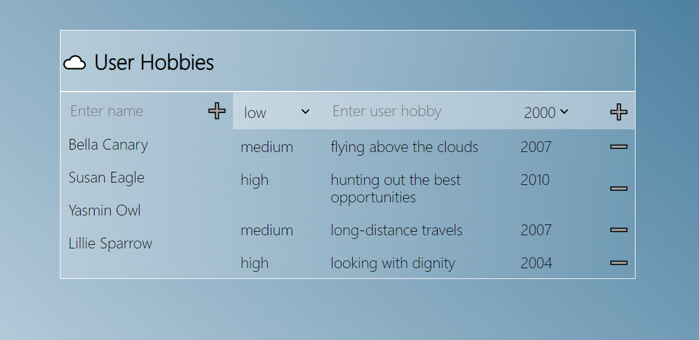

 

 
  <h3 align="center">Arive_App
</h3>

  <h3 align="center">
    ☁️ Web application to make your hobbies fly
  </h3>

<!-- ABOUT THE PROJECT -->

### About The Project

This project serves to demonstrate the design patterns and basic libraries of React applications.
It as bootstrapped with [Create React App](https://github.com/facebook/create-react-app). On top of that it uses typescript, react-query for retrieving data from the server, redux toolkit for global state management, sass for style management, node express.js to mock server api and also JEST plus enzyme for writing unit tests.

Design patterns used:

- division of components into reusable and not reusable
- separate sass files for each component
- composition design pattern over inheritance
- lifting up state to avoid unnecessary use of redux
- uncontrolled components with forms to avoid unnecessary rendering
- forwardRef to split uncontrolled components

### How to run the app

The app is built from the `server app` and the `client app`.

To make sure the client app works correctly, you need to take those three steps:

Edit `.env` file in root directory, and set environment variable: `REACT_APP_NETWORK_IP=172.21.3.165`
replacing its value with your local network IP.
To obtain the IP you can run `yarn start` and take the IP from the console output:

2. Run `yarn server` in your console in order to start the **server app** mocking the endpoint

3. Run `yarn start` to start `client app` while server app is running in the background

> Note: if the client app was still running before created .env.local containing your IP, you need to restart the client app)

### Built With

- [React](https://reactjs.org/)
- [TypeScript](https://www.typescriptlang.org/)
- [Sass](https://sass-lang.com/)
- Express
- Redux Toolkit
- React Query

<!-- CONTACT -->

### Contact

Gregor Pawlak - [linkedIn](https://www.linkedin.com/in/grzegorz-pawlak/)

Project Link: [https://github.com/Greqorian/IKEA_classifier_frontend](https://github.com/Greqorian/IKEA_classifier_frontend)

## Available Scripts

In the project directory, you can run:

### `yarn server`

Runs the local server mocking endpoint for client.\
Open [http://localhost:3005](http://localhost:3005) to view it in the browser.

The page will reload if you make edits.\
You will also see any lint errors in the console.

### `yarn start`

Runs the app in the development mode.\
Open [http://localhost:3000](http://localhost:3000) to view it in the browser.

The page will reload if you make edits.\
You will also see any lint errors in the console.

### `yarn test`

Launches the test runner in the interactive watch mode.\
See the section about [running tests](https://facebook.github.io/create-react-app/docs/running-tests) for more information.
